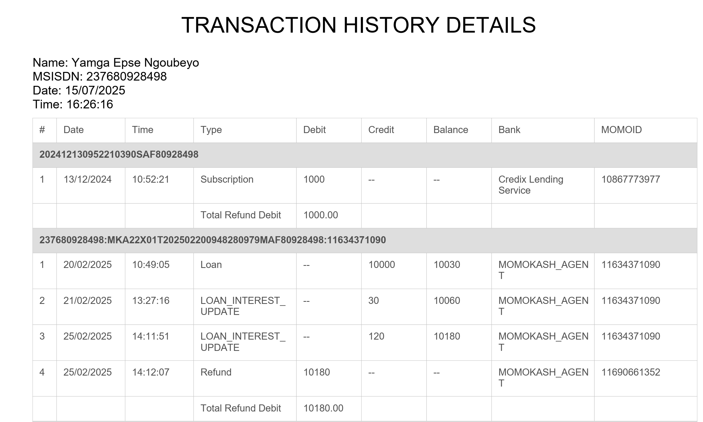

# Documentation du Microservice JRtools

## Introduction

Le microservice JRtools est une application Spring Boot
conçue pour gérer le cycle de vie JasperReports (`.jrxml` ou compilés `.jasper`) et pour générer des rapports PDF à
partir de ces modèles et de données fournies. Il offre des fonctionnalités

- d'`upload`,
- de `mise à jour`,
- de `suppression` et
- de `téléchargement` de modèles, ainsi que
- la `génération` et
- le `téléchargement` de rapports finaux.

## Technologies Utilisées

* **Spring Boot**: Framework principal pour le développement de l'application.
* **JasperReports** : Bibliothèque de reporting pour la génération de documents.
* **Lombok** : Réduit le code boilerplate (constructeurs, getters/setters, etc.).
* **Spring Data JPA**: Pour l'accès aux données persistantes (Hibernate inclus)
* **Maven**: Outil de gestion de projet.

## Architecture

Le service suit une architecture MVC (Model-View-Controller) pour les API REST, avec une couche de service pour la
logique métier et une couche de repository pour l'accès aux données.

* **`controller`**: Gère les requêtes HTTP entrantes et retourne les réponses.
* **`service`**: Contient la logique métier pour la gestion des modèles et la génération de rapports.
* **`repository`**: Interface pour interagir avec la base de données (entités `ReportTemplate`).
* **`dto`**: Objets de transfert de données (`ReportDataRequest`) pour les requêtes JSON.
* **`entity`**: Représente les objets persistants de la base de données (`ReportTemplate`).
* **`exception`**: Classes d'exceptions personnalisées.

## Entités

### `ReportTemplate`

Cette entité représente un modèle de rapport JasperReports stocké dans le système.

| Champ         | Type      | Description                                                    |
|:--------------|:----------|:---------------------------------------------------------------|
| `id`          | `Integer` | Identifiant unique du modèle (auto-généré).                    |
| `tag`         | `String`  | Tag unique pour identifier le modèle (utilisé dans les URLs).  |
| `description` | `String`  | Description textuelle du modèle.                               |
| `directory`   | `String`  | Chemin absolu du fichier modèle sur le système de fichiers.    |
| `createdAt`   | `Date`    | Date de création de l'enregistrement (horodatage automatique). |
| `updatedAt`   | `Date`    | Date de la dernière mise à jour (horodatage automatique).      |

## Objets de Transfert de Données (DTO)

### `ReportDataRequest`

Cet objet est utilisé pour encapsuler les données nécessaires à la génération d'un rapport JasperReports. Il est
flexible et peut contenir à la fois des paramètres simples et des sources de données complexes (listes de maps).

**Exemple :**

```json
{
  "parametreSimple1": "valeur1",
  "parametreSimple2": 123,
  "dataSourcePrincipale": [
    {
      "champ1": "ligne1_col1",
      "champ2": "ligne1_col2"
    },
    {
      "champ1": "ligne2_col1",
      "champ2": "ligne2_col2"
    }
  ],
  "autreDataSource": [
    {
      "id": 1,
      "nom": "Produit A"
    }
  ]
}
```

* **`parameters` (Map<String, Object>)** : Contient les paramètres simples passés directement au rapport Jasper.
* **`dataSources` (Map<String, List<Map<String, ?>>>)** : Contient les sources de données sous forme de listes de maps.
  Chaque liste correspondra à un `JRMapCollectionDataSource` dans JasperReports, utile pour les sous-rapports ou les
  tableaux dynamiques.

## Configuration

Le microservice utilise des propriétés pour définir les répertoires de stockage des modèles et des rapports. Celles-ci
doivent être configurées dans `application.properties` ou `application.yml`.

```properties
app.template.dir=/path/to/templates/
app.report.dir=/path/to/reports/
```

**Exemple (application.properties) :**

```properties
app.template.dir=./templates/
app.report.dir=./reports/
```

Assurez-vous que le service dispose des droits d'écriture dans ces répertoires.

## Points d'Accès API (Endpoints)

### Résumé des Endpoints du Microservice JasperReports

# Résumé des Endpoints de `ReportController`

| Méthode | Endpoint                        | Description                                                     | Entrées attendues                                                                                   | Sortie / Réponse                                                                 |
|---------|---------------------------------|-----------------------------------------------------------------|-----------------------------------------------------------------------------------------------------|----------------------------------------------------------------------------------|
| POST    | `/api/templates/upload`         | Upload d’un nouveau template JRXML                              | Params : `tag` (String), `description` (String), `file` (MultipartFile)                             | 201 Created + JSON contenant les infos du template                               |
| PUT     | `/api/templates/{tag}`          | Met à jour un template existant                                 | PathVariable : `tag` ; Params : `description` (String), `file` (MultipartFile)                      | 200 OK + JSON avec les infos mises à jour du template                            |
| DELETE  | `/api/templates/{tag}`          | Supprime un template existant                                   | PathVariable : `tag`                                                                                | 200 OK : "Template supprimé avec succès"                                         |
| GET     | `/api/templates`                | Liste tous les templates enregistrés                            | Aucun                                                                                               | 200 OK + JSON : `[ {tag, description, ...}, ... ]`                               |
| GET     | `/api/templates/download/{tag}` | Télécharge un template JRXML existant                           | PathVariable : `tag`                                                                                | Fichier `.jrxml` (`application/octet-stream`)                                    |
| POST    | `/api/report/generate/{tag}`    | Génère un rapport PDF à partir d’un template et de données JSON | PathVariable : `tag`, Body JSON : `ReportDataRequest` (customerName, msisdn, date, time, groups, …) | 200 OK (si succès) : `"rapport generé avec succes"` ou 500 Internal Server Error |
| GET     | `/api/report/download/{tag}`    | Télécharge le rapport PDF généré                                | PathVariable : `tag`                                                                                | Fichier `.pdf` (`application/pdf`)                                               |

### 1. Uploader un modèle de rapport

Permet d'envoyer un fichier de modèle JasperReports (généralement `.jrxml` ou `.jasper`) et de l'associer à un `tag`
unique. Les sous rapports doivent être envoyés en `.jasper`.

* **URL**: `/api/templates/upload`
* **Méthode**: `POST`
* **Paramètres de requête**:
    * `tag` (String, Obligatoire) : Identifiant unique pour le modèle.
    * `description` (String, Obligatoire): Description du modèle.
    * `file` (MultipartFile, Obligatoire) : Le fichier du modèle (`.jrxml` ou `.jasper`).

* **Réponse** :
    * `201 Created` si l'upload réussit, avec l'entité `ReportTemplate` enregistrée et l'URI de téléchargement.
    * `409 Conflict` (ou `500 Internal Server Error` avec le message de `RemoteException`) si un template avec le même
      tag existe déjà.
    * `500 Internal Server Error` en cas d'erreur interne du serveur (ex : problème d'écriture sur le disque).

### 2. Mettre à jour un modèle de rapport

Permet de remplacer un fichier de modèle existant ou de mettre à jour sa description.

* **URL**: `/api/templates/{tag}`
* **Méthode**: `PUT`
* **Paramètres de chemin** :
    * `tag` (String, Obligatoire) : Le tag du modèle à mettre à jour.
* **Paramètres de requête**:
    * `description` (String, Obligatoire) : Nouvelle description du modèle.
    * `file` (MultipartFile, Obligatoire) : Le nouveau fichier du modèle.

* **Réponse** :
    * `200 OK` si la mise à jour réussit, avec l'entité `ReportTemplate` mise à jour.
    * `404 Not Found` si aucun template n'est trouvé avec le tag spécifié.
    * `500 Internal Server Error` en cas d'erreur.

### 3. Supprimer un modèle de rapport

Supprime un modèle de rapport et son fichier associé du système.

* **URL**: `/api/templates/{tag}`
* **Méthode**: `DELETE`
* **Paramètres de chemin** :
    * `tag` (String, Obligatoire) : Le tag du modèle à supprimer.
* **Réponse** :
    * `200 OK` avec le message "Template supprimé avec succès".
    * `404 Not Found` si aucun template n'est trouvé avec le tag spécifié.
    * `500 Internal Server Error` en cas d'erreur (ex : impossibilité de supprimer le fichier).

### 4. Générer un rapport PDF

Génère un rapport PDF en utilisant un modèle existant et les données fournies dans le corps de la requête.

* **URL**: `/api/report/generate/{tag}`
* **Méthode**: `POST`
* **Paramètres de chemin** :
    * `tag` (String, Obligatoire) : Le tag du modèle à utiliser pour la génération.
* **Corps de la Requête**: `ReportDataRequest` (JSON)
* **Exemple de Requête (application/json)**:
  ```http
  POST /api/report/generate/monPremierRapport
  Content-Type: application/json

  {
    "titreRapport": "Rapport Annuel 2023",
    "dateGeneration": "2023-11-15",
    "listeProduits": [
      {
        "nom": "Produit A",
        "quantite": 100,
        "prixUnitaire": 10.50
      },
      {
        "nom": "Produit B",
        "quantite": 50,
        "prixUnitaire": 20.00
      }
    ]
  }
  ```
* **Réponse** :
    * `200 OK` avec le message "rapport generé avec succes" si la génération et la sauvegarde réussissent.
    * `404 Not Found` si aucun template n'est trouvé avec le tag spécifié.
    * `500 Internal Server Error` en cas d'échec de la génération ou de la sauvegarde (voir les logs pour plus de
      détails). Le rapport généré est sauvegardé sur le disque dans le `app.report.dir`.

### 5. Télécharger un rapport PDF généré

Permet de télécharger un rapport PDF qui a été précédemment généré et sauvegardé.

* **URL**: `/api/report/download/{tag}`
* **Méthode**: `GET`
* **Paramètres de chemin** :
    * `tag` (String, Obligatoire) : Le tag du rapport à télécharger (correspond au nom du fichier PDF).
* **Réponse** :
    * `200 OK` avec le fichier PDF en pièce jointe (`application/pdf`).
    * `404 Not Found` si le fichier PDF n'existe pas dans le répertoire `app.report.dir`.
    * `500 Internal Server Error` en cas d'erreur de lecture du fichier.

### 6. Télécharger un modèle de rapport

Permet de télécharger un fichier de modèle JasperReports qui a été précédemment uploadé.

* **URL**: `/api/templates/download/{tag}`
* **Méthode**: `GET`
* **Paramètres de chemin** :
    * `tag` (String, Obligatoire) : Le tag du modèle à télécharger.
* **Réponse** :
    * `200 OK` avec le fichier modèle en pièce jointe (`application/octet-stream`).
    * `404 Not Found` si le fichier modèle n'existe pas.
    * `500 Internal Server Error` en cas d'erreur de lecture du fichier.

## Comment Utiliser (Exemple d'intégration)

### Prérequis

* Un environnement Java 17+.
* Maven installé.
* Une base de données (H2, MySQL, PostgreSQL, etc.) configurée dans `application.properties`.

### Étapes

1. **Cloner le dépôt** (si ce n'est pas déjà fait).
2. **Configurer `application.properties`**:
    * Définir `app.template.dir` et `app.report.dir`.
    * Configurer la connexion à la base de données (exemple pour H2 en mémoire) :
      ```properties
      spring.datasource.url=jdbc:h2:mem:jrtoolsdb
      spring.datasource.driverClassName=org.h2.Driver
      spring.datasource.username=sa
      spring.datasource.password=password
      spring.jpa.database-platform=org.hibernate.dialect.H2Dialect
      spring.jpa.hibernate.ddl-auto=update # ou create pour le développement
      ```

## Guide de conception des templates jasper

### Introduction

Nous allons dans cette rubrique rediger un guide qui permet
d'afficher un rapport comme celui-ci.


Le format du JSON qui sera recu a pour model ce qui suit:

```json
{
  "name": "Yamga Epse Ngoubeyo",
  "msisdn": "237680928498",
  "date": "15/07/2025",
  "time": "16:26:16",
  "transactionGroupsDS": [
    {
      "groupId": "G1",
      "transactions": [
        {
          "number": 1,
          "date": "22/05/2025",
          "time": "08:53:59",
          "type": "Loan",
          "debit": 0.0,
          "credit": 50000.0,
          "balance": 50150.0,
          "bank": "MOMOKASH_AGENT",
          "momoid": "12648312233"
        },
        {
          "number": 2,
          "date": "10/06/2025",
          "time": "09:53:59",
          "type": "Refund",
          "debit": 0.0,
          "credit": 50000.0,
          "balance": 100150.0,
          "bank": "MOMOKASH_AGENT",
          "momoid": "12648312233"
        }
      ]
    }
  ]
}
```

Pour y arriver, nous allons utiliser trois niveaux de rapports :

1. Rapport principal (main_report)

    - Affiche les infos client et la date.
    - Contient un sous-rapport pour les groupes.

2. Sous-rapport des groupes (groups_report)
    - Parcourt les groupes.
    - Affiche groupId.
    - Contient un sous-rapport pour les transactions.

3. Sous-rapport des transactions (transactions_report)
    - Affiche un tableau listant les transactions.

Il faut adapter les paramètres, datasets et sous-rapports afin que le moteur
JasperReports comprenne la structure hiérarchique du JSON.  
Un JSON peut contenir :

- Paramètres simples sous format clé valeurs (texte, date, nombres)
- Listes imbriquées (collections d’objets → transactions, groupes, etc.)
- Objets enfants (sous-blocs de données).

L'idée générale est la suivante :

1. Paramètres simples
   Les valeurs uniques du JSON deviennent des Parameters dans JasperSoft Studio.  
   **Exemple** :
    ````
    - mame:  -> java.lang.String
    - msisdn -> java.lang.String
    - reportDate -> java.lang.String (ou java.util.Date)
    - reportTime -> java.lang.String
   ````
2. Listes et collections → Datasets & Subreports
   Quand un champ contient une liste d’objets JSON, on ne peut pas l’afficher directement.  
   On utilise soit :
    - Subreport (fichier `.jasper` séparé)
    - Table Component

**Exemple : `transactionGroupsDS`**  
Dans le rapport principal, créer un Parameter :  
`transactionGroupsDS -> Type = net.sf.jasperreports.engine.JRDataSource`  
On passe cette liste depuis le code Java comme une `JRMapCollectionDataSource`.  
Ensuite :  
Dans le rapport principal : insérer un Subreport.
Passer `transactionGroupsDS` comme DataSource Expression au sous-rapport.

### Mise en pratique

#### Étape 1 : Le rapport principal:

Les paramètres à créer

| Nom                   | Type         | Utilisation                               |
|-----------------------|--------------|-------------------------------------------|
| `name`                | String       | Nom du client                             |
| `msisdn`              | String       | Numéro de téléphone                       |
| `date`                | String/Date  | Date du rapport                           |
| `time`                | String       | Heure du rapport                          |
| `transactionsGroupDS` | JRDataSource | Liste des groupes (`transactionsGroupDS`) |
| `SUBREPORT_DIR`       | String       | Dossier des sous-rapports                 |

Dans le rapport :

- Placer des Text Fields liés à `$P{name}, $P{msisdn}, $P{date}, $P{time}`.
- Ajouter un Subreport :
- Expression du rapport ` $P{SUBREPORT_DIR} + "groupeId.jasper"` (chemin du sous rapport)
- DataSource Expression `$P{transactionsGroupDS}`

#### Etape 2 : Sous rapport (groupeId)

Dans le sous-rapport (groupeID) :

Créer les champs :

- groupId (String)
- transactions (Collection)

Créer un paramètre SUBREPORT_DIR (String) pour indiquer le chemin du sous-rapport

Placer les éléments suivant dans le sous-rapport :

- Un Text Field affichant $F{groupId}
- Un Subreport pour les transactions :
- Expression du rapport `-> $P{SUBREPORT_DIR} + "detail.jasper"`
- DataSource Expression :

```
new net.sf.jasperreports.engine.data.JRMapCollectionDataSource(
    (java.util.Collection)$F {
    transactions
}
    )
```

#### Etape 3 : Sous rapport (details)

Les champs à creer :

| Nom     | Type    |
|---------|---------|
| number  | Integer |
| date    | String  |
| time    | String  |
| type    | String  |
| debit   | Double  |
| credit  | Double  |
| balance | Double  |
| bank    | String  |
| momoid  | String  |

Éléments à placer dans le sous-rapport :

- Insérer une Table Component pour afficher les tableaux.
- Créer un SubDataset appelé TransactionsDataset.
- Associer la DataSource Expression à $P{REPORT_DATA_SOURCE}.
- Ajouter les colonnes (number, date, time, type, debit, credit, balance, bank, momoid).  
  ⚠️ Important :  
  _Ne cochez pas Use first row as column header, sinon Jasper prend la première transaction comme titre._

 


